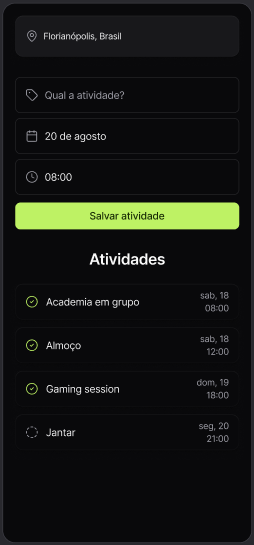
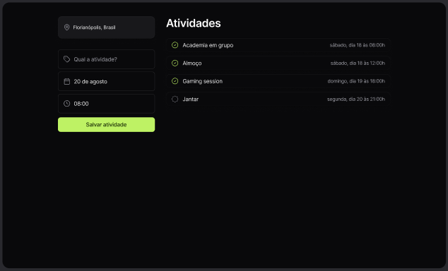

## Projeto Roteiro de Viagem ✈️
**`RocketSeat`** 🚀

Este projeto é um site responsivo para montar um roteiro de viagem, cadastrando atividades. Esse é um dos projetos do evento NLW Journey da Rocketseat.  

- Criação de estrutura base com **HTML**;
- Estilização com **CSS** e **JavaScript**;
- Aplicação de lógica de programação com **JavaScript**;
- Utilização do **Day.js** para datas. 

